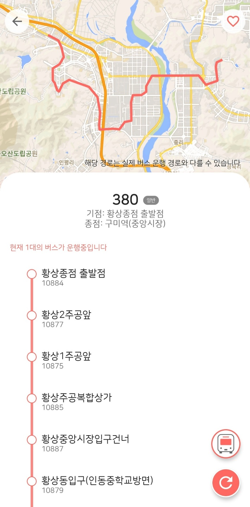

# GumiBusInfo
구미 버스탈래요

## Google Play

https://play.google.com/store/apps/details?id=com.jin.businfo_gumi

## Screenshot

   

## Description

You can see bus arrival information and current bus location by bus stop.

You can find bus stops by navigating to nearby stops or by searching.

## Skills

* Kotlin
* Splitties
* Dagger
* RxKotlin/RxAndroid
* Retrofit
* OkHttp3
* XmlParser
* Firebase
* Google Map
* Open Source License Plugin
* Google Play In-App Review
* Admob AdView
* GPS Location Detection
* DynamicAnimaction (SpringAnimation)
* Material Design
